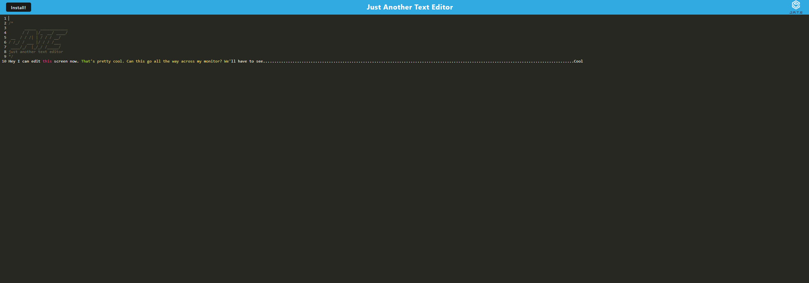

# PWA-text-editor
Your task is to build a text editor that runs in the browser. The app will be a single-page application that meets the PWA criteria. Additionally, it will feature a number of data persistence techniques that serve as redundancy in case one of the options is not supported by the browser. The application will also function offline.

[Link to Website](https://arcane-shelf-95218.herokuapp.com/ "Link to PWA text editor site")